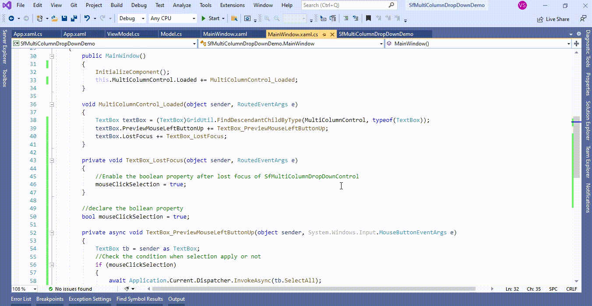
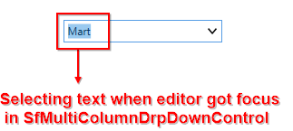

# How to select entire text on mouse click in WPF MultiColumnDropDown (SfMultiColumnDropDown)?

## About the sample
This example illustrates how to select entire text on mouse click in [WPF MultiColumnDropDown](https://www.syncfusion.com/wpf-controls/multi-column-dropdown) (SfMultiColumnDropDown)?

[WPF MultiColumnDropDown](https://www.syncfusion.com/wpf-controls/multi-column-dropdown) (SfMultiColumnDropDown) allows you to edit via TextBox. You can select the text displayed in the textbox when it got the focus from any other control by wiring the Loaded event of [WPF MultiColumnDropDown](https://www.syncfusion.com/wpf-controls/multi-column-dropdown) (SfMultiColumnDropDown) and calling the TextBox Control **SelectAll** method in the **TextBox.PreviewMouseLeftButtonUp** event and defining the Boolean property customization in lost focus event.  

```C#
public partial class MainWindow : Window
{
        public MainWindow()
        {
            InitializeComponent();
            this.MultiColumnControl.Loaded += MultiColumnControl_Loaded;
        }

        void MultiColumnControl_Loaded(object sender, RoutedEventArgs e)
        {
            TextBox textBox = (TextBox)GridUtil.FindDescendantChildByType(MultiColumnControl, typeof(TextBox));
            textBox.PreviewMouseLeftButtonUp += TextBox_PreviewMouseLeftButtonUp;
            textBox.LostFocus += TextBox_LostFocus;
        }

        private void TextBox_LostFocus(object sender, RoutedEventArgs e)
        {
            //Enable the boolean property after lost focus of SfMultiColumnDropDownControl 
            mouseClickSelection = true;
        }

        //declare the bollean property 
        bool mouseClickSelection = true;

        private async void TextBox_PreviewMouseLeftButtonUp(object sender, System.Windows.Input.MouseButtonEventArgs e)
        {
            TextBox tb = sender as TextBox;
            //Check the condition when selection apply or not 
            if (mouseClickSelection)
            {
                await Application.Current.Dispatcher.InvokeAsync(tb.SelectAll);
                //disable the boolean porperty to selection apply only first time in SfMultiColumnDropDownControl via mouse click 
                mouseClickSelection = false;
            }
        }

        protected override void OnClosing(CancelEventArgs e)
        {
            TextBox textBox = (TextBox)GridUtil.FindDescendantChildByType(MultiColumnControl, typeof(TextBox));
            textBox.PreviewMouseLeftButtonUp -= TextBox_PreviewMouseLeftButtonUp;
            this.MultiColumnControl.Loaded -= MultiColumnControl_Loaded;
        }
}

```


The following screenshot shows the selecting text when editor got focus in [WPF MultiColumnDropDown](https://www.syncfusion.com/wpf-controls/multi-column-dropdown) (SfMultiColumnDropDown),



Take a moment to peruse the [WPF MultiColumnDropDown - Editing and Auto complete](https://help.syncfusion.com/wpf/multi-column-dropdown/editing-and-autocomplete) documentation, where you can find about editing and auto complete with code examples.

Please refer this [link](https://www.syncfusion.com/wpf-controls/multi-column-dropdown) to know about the essential features of WPF MultiColumnDropDown.

## Requirements to run the demo
Visual Studio 2015 and above versions
